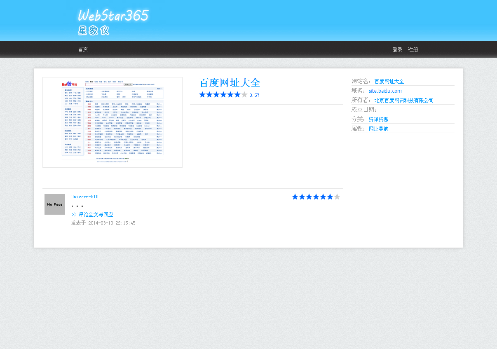
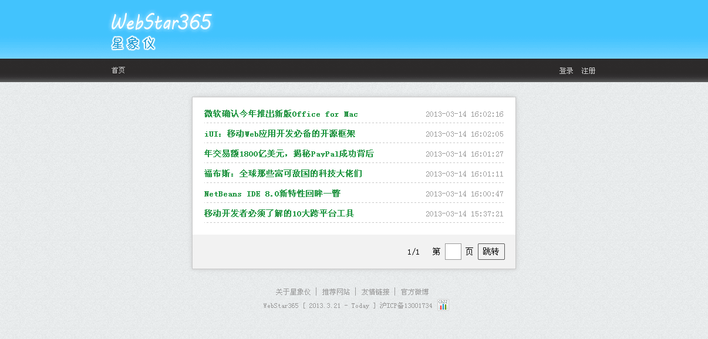

# 基本信息

* 开发时间：2012.11 ~ 2013.2
* 设计：Photoshop + Illustrator
* 前端：HTML + CSS + JavaScript / jQuery
* 后端：Java / Struts2 / Spring / iBatis
* 数据库 - MySQL

# 理念

当我想找关于编程的书，我会去豆瓣搜索，参考人们的评分与评论。那么，如果想找一个小说网站，我不了解有哪些，也不知道哪些好，该怎么找？百度吗？搜索引擎以网页为单位，结果庞杂无章。朋友推荐？缺乏统计数据的推荐难免片面。无论如何，都很费时不讨好啊！

「星象仪」为此诞生，这是一个整理、检索、评论网站的网站。

# UI截图

